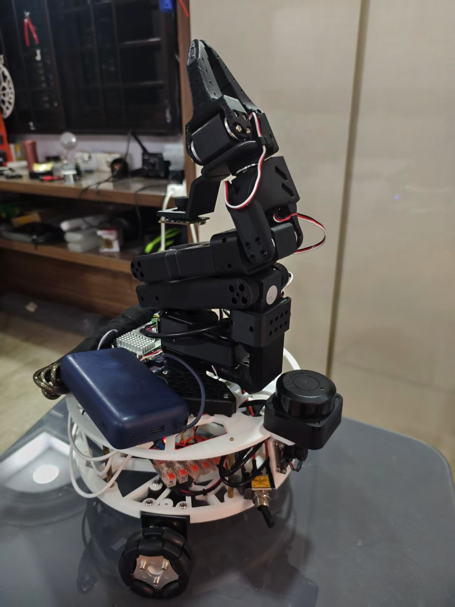
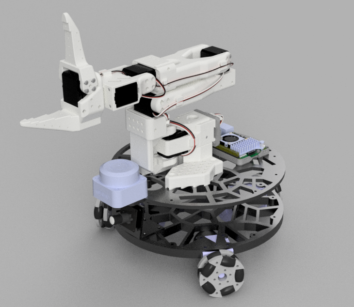

<h1 align="center">mmr_bot</h1>

<p align="center">
  <b>A three-wheeled omnidirectional robot you can drive from your keyboard, map a room with, and send to a goal.</b><br>
  ROS 2 Jazzy description, Gazebo simulation, a UDP bridge to its ESP32, SLAM and Nav2.
</p>

<p align="center">
  <sub>
    <a href="#quick-start">Quick start</a> ·
    <a href="#driving-it">Driving it</a> ·
    <a href="#mapping-and-navigation">Mapping &amp; navigation</a> ·
    <a href="#the-robot">The robot</a> ·
    <a href="#documentation">Full docs</a>
  </sub>
</p>

<table align="center">
<tr>
  <td align="center"></td>
  <td align="center"></td>
</tr>
<tr>
  <td align="center"><sub>As built — SO-101 arm, RPLIDAR C1, one omniwheel in view</sub></td>
  <td align="center"><sub>The CAD model every dimension is measured from</sub></td>
</tr>
</table>


|  |  |
|---|---|
| **Base** | Kiwi drive — 3 omniwheels at 60° / 180° / 300°, Ø 60 mm, on a Ø 240 mm plate |
| **Arm** | SO-101, 6 movable joints, vendored from [TheRobotStudio](https://github.com/TheRobotStudio/SO-ARM100) |
| **Sensors** | RPLIDAR C1 (USB), USB camera. **No encoders** — which is why odometry comes from the lidar |
| **Compute** | Raspberry Pi 5 (Ubuntu 24.04, ROS 2 Jazzy) → WiFi → ESP32 (motor PWM) |
| **Geometry** | Measured from the Fusion 360 STEP export (`mmr_bot.step`). Nothing invented — see [TODOs](docs/status.md#assumptions-and-todos) |

> ### ⚠️ Read this before trusting anything below
>
> This package was built on a Windows machine **with no ROS 2 installed**.
> `xacro`, `colcon`, `rviz2`, `ros2` and Gazebo were never run, and neither the
> Pi nor the ESP32 was ever reachable from it — **no packet from this code has
> ever left the machine that wrote it.**
>
> What *was* run is a set of offline reimplementations, listed honestly in
> [what is and isn't verified](docs/status.md#what-is-and-isnt-verified). Claims
> that need hardware are marked individually rather than glossed over.

---

## Quick start

```bash
cd ~/ros2_ws/src && cp -r /path/to/mmr_pkg .
cd ~/ros2_ws
rosdep install --from-paths src -y --ignore-src
colcon build --packages-select mmr_pkg && source install/setup.bash
```

Two packages are **not** rosdep keys and must be cloned into `src/` yourself —
naming them in `package.xml` would make `rosdep install` abort before it
resolved anything else:

```bash
git clone https://github.com/Slamtec/sllidar_ros2.git                 # the C1 driver
git clone -b ros2 https://github.com/MAPIRlab/rf2o_laser_odometry.git  # odometry
```

| | Command | Where |
|---|---|---|
| **1. Description in RViz** | `ros2 launch mmr_pkg display.launch.py` | anywhere |
| **2. Gazebo** | `ros2 launch mmr_pkg gazebo.launch.py` | anywhere |
| **3. The real robot** | `ros2 launch mmr_pkg robot.launch.py esp32_ip:=10.229.5.249` | Pi |
| | `ros2 launch mmr_pkg teleop.launch.py` | desktop |
| | `ros2 run mmr_pkg kb_teleop` | desktop, **own terminal, needs focus** |
| **4. Map while you drive** | `ros2 launch mmr_pkg teleop.launch.py slam:=true` | desktop, RViz + SLAM in one |
| **5. Map and navigate** | `ros2 launch mmr_pkg slam.launch.py` | desktop |
| | `ros2 launch mmr_pkg nav2.launch.py` | desktop |

Common arguments: `esp32_ip:=`, `lidar:=false`, `camera:=false`, `bridge:=false`,
`image_width:=`, `image_height:=`, `video_device:=`, `serial_port:=`.
`gazebo.launch.py` takes `headless:=`, `rviz:=`, `world:=`.
`teleop.launch.py` takes `slam:=`, `show_map:=`, `rviz_config:=`.

Each driver can be disabled independently, and **one failing does not take the
others down**: no node in `robot.launch.py` has an `on_exit` handler, so an
unplugged camera stops the camera and leaves the lidar and the drive bridge
running. Adding a single `Shutdown` handler would quietly undo that.

Checks that need no build, no ROS and no hardware:

```bash
python tools/check_repo.py     # 0 failures over 141 checks, under a second
python -m pytest test/ -q      # 119 passed
```

---

## Driving it

This works with **no firmware change**. The ESP32 sketch already accepts a polar
command over UDP and does its own wheel mixing, so `mmr_pkg/esp32_protocol.py`
reproduces what `esp32/controller.py` sends — byte for byte, which
`test/test_esp32_bridge.py` enforces.

```
         q   w   e          w / x   forward / back
           a   d            a / d   strafe left / right
             x              q / e   turn left / right

    SPACE  stop now         + / -   faster / slower
    k      quit             [ / ]   turn slower / faster
```

**`x` is reverse, not `s`** — `s` is deliberately bound to nothing. The map is a
table at the top of `mmr_pkg/teleop_keys.py` and that is the only place to change
it; a test asserts no key has two jobs and that all six directions are present.

Three things worth knowing before you press a key:

- **`kb_teleop` is not started by any launch file, on purpose.** It reads raw
  keypresses from stdin, and `ros2 launch` gives its children no controlling
  terminal — so launching it would produce a node that starts, looks healthy,
  publishes a steady stream of zeros and never registers a keystroke. It refuses
  to start when stdin is not a TTY rather than pretend.
- **A terminal cannot detect key release.** There is no key-up event, so release
  is inferred from auto-repeat stopping; `key_timeout` (0.6 s) must exceed your
  terminal's initial repeat delay. SPACE is immediate, and the firmware's 400 ms
  deadman is underneath everything regardless.
- **Defaults are 0.5 m/s and 1.0 rad/s**, which is about half PWM. Those units
  are a declared normalisation, not a measurement — see
  [TODO 13](docs/status.md#assumptions-and-todos).

---

## Mapping and navigation

To drive around and watch the map build, two terminals on the desktop:

```bash
ros2 launch mmr_pkg robot.launch.py esp32_ip:=10.115.35.249  # Pi
ros2 launch mmr_pkg teleop.launch.py slam:=true              # desktop: SLAM + RViz with the map
ros2 run  mmr_pkg kb_teleop                                  # desktop, own terminal
```

`slam:=true` starts `slam.launch.py` alongside RViz and swaps in
`rviz/mapping.rviz`, whose Fixed Frame is `map` so the map holds still and the
robot moves through it. Running `slam.launch.py` yourself instead? Use
`show_map:=true` to get the same view without starting a second `slam_toolbox`.

The full set, when you want Nav2 as well:

```bash
ros2 launch mmr_pkg robot.launch.py esp32_ip:=10.229.5.249  # Pi
ros2 launch mmr_pkg slam.launch.py                           # desktop: odom + slam_toolbox
ros2 launch mmr_pkg nav2.launch.py                           # desktop
ros2 launch mmr_pkg teleop.launch.py show_map:=true          # desktop: RViz with the map
ros2 run  mmr_pkg kb_teleop                                  # drive around to build the map

ros2 run nav2_map_server map_saver_cli -f ~/my_map           # save it
ros2 launch mmr_pkg nav2.launch.py map:=$HOME/my_map.yaml    # navigate it later
```

Then give it a goal with RViz's **2D Goal Pose** button.

**The one thing you have to understand:** `slam_toolbox` and Nav2 both require a
TF `odom → base_footprint` to already exist. Neither produces it. This robot has
**no encoders**, so `slam.launch.py` runs `rf2o_laser_odometry`, which derives
motion from the range flow between consecutive lidar scans — a real measurement
in real metres, not an integration of what we *asked* the robot to do. Without
it, both stacks come up cleanly, activate cleanly, and then sit logging transform
timeouts forever.

That choice has costs, and they are stated plainly in
**[docs/slam-and-nav2.md](docs/slam-and-nav2.md)**, along with:

- what rf2o gets wrong (blank corridors, fast rotation) and why it is not
  independent of `slam_toolbox`'s own scan matching;
- the **three Nav2 defaults that silently delete sideways motion** on a
  holonomic base, leaving a robot that drives, turns and never strafes with
  nothing logged. This is why `config/nav2.yaml` is not optional;
- why exactly one thing may publish `map → odom`, and how to choose which;
- how rf2o finally makes `cmd_vel` calibratable in real metres.

Everything in `slam.launch.py` and `nav2.launch.py` runs on the **desktop**.
`/scan` is ~20 kB/s so shipping it over WiFi is cheap; scan matching and loop
closure on a Pi 5 already running the lidar, the camera and the bridge are not.

---

## When it doesn't work

The four that are the answer most often. Everything else — with a command to run
for each, rather than a thing to eyeball — is in
**[docs/troubleshooting.md](docs/troubleshooting.md)**.

| What you see | Most likely cause | What to do |
|---|---|---|
| No movement, **no error anywhere** | Wrong `esp32_ip`. UDP has no connection, so packets to a wrong host vanish in complete silence | `ros2 topic echo /diagnostics` — look for `state: down` with `replies_received: 0` |
| Strafes the **wrong way** (A goes right) | Motor wiring handedness — a coin flip until [the wiring is confirmed](docs/hardware.md#-the-firmware-and-the-simulation-disagree-about-which-way-is-left) | `strafe_sign: -1` in `config/esp32_bridge.yaml`. **Do not** edit the angle arithmetic |
| **Camera feed runs seconds behind** | Raw transport. 640×480 rgb8 is 921,600 B/frame — 221 Mbit/s at 30 fps, which no WiFi here carries | Install `compressed_image_transport` **on both machines**; `rviz/teleop.rviz` already asks for the compressed topic at queue depth 1 |
| `Frame [odom] does not exist` | Nothing publishes `odom → base_footprint` unless `slam.launch.py` is running | Start it, or set the fixed frame to `base_footprint` |

When in doubt, the two commands that need nothing installed:
`python tools/check_repo.py` and `python -m pytest test/ -q`.

---

## Configuration

One file per concern, all loaded by the launch files, so there is one place to
change a number.

| File | Tunes | |
|---|---|---|
| `config/esp32_bridge.yaml` | `/cmd_vel` → UDP: speed map, watchdogs, sign flips, rate limiting | [Every parameter](docs/configuration.md#bridge-parameters) |
| `config/slam_toolbox.yaml` | Mapping | Upstream's file, 3 marked changes |
| `config/nav2.yaml` | Navigation | Upstream's file, 14 marked changes. **Nav2's own defaults are not a safe substitute here** |
| `config/controllers.yaml` | `ros2_control`, simulation only | |

`esp32_ip` is deliberately *not* in a config file — it follows the DHCP lease, so
it belongs on the command line where a stale value cannot be committed.

The bridge answers *"is the link alive, and how bad is it?"* on `/diagnostics`
rather than by printing: link state, reply ratio, `/cmd_vel` age. That is the
first thing to look at when the robot does not move.

Both machines need the same `ROS_DOMAIN_ID`, the same subnet and working
multicast. **Check for a leftover `export ROS_LOCALHOST_ONLY=1` first** — it is
deprecated but still honoured, and it overrides
`ROS_AUTOMATIC_DISCOVERY_RANGE`. More in
[docs/configuration.md](docs/configuration.md#networking).

---

## The robot

```
base_footprint                          ground plane, under the wheel-triad centre
 └── base_link                          [fixed]        z = +0.045
     ├── wheel_0_link                   [continuous]    60°
     ├── wheel_1_link                   [continuous]   180°
     ├── wheel_2_link                   [continuous]   300°
     ├── laser_frame                    [fixed]        RPLIDAR C1
     └── arm_base_link                  [fixed]
         └── … 6 revolute joints to the gripper
```

**14 links, 13 joints, 9 of them movable** — 3 wheels + 6 arm.

| | |
|---|---|
| Wheel radius | 0.030 m |
| Base radius (centre → wheel) | 0.135500 m, all three equal to <0.001 mm |
| `base_link` height | 0.045 m above ground |
| Wheel mounting angles | 60°, 180°, 300° |
| Robot +X (forward) | = CAD −Y, the direction the lidar, camera and arm face |

The kinematics are one commented function, `inverse_kinematics()` in
**`mmr_pkg/kiwi_kinematics.py`**, which imports no ROS so you can run it
standalone:

```
ω_i = ( vx·sin α_i − vy·cos α_i − L·ωz ) / R    α = 60°/180°/300°, L = 0.1355, R = 0.030
```

Full measurements, their provenance and the sign convention:
**[docs/hardware.md](docs/hardware.md)**.

### ⚠️ Two things to settle before you trust it

1. **The firmware and this package disagree about which way is left.**
   `tools/firmware_diff.py` reads the `.ino` directly and reports a reflection on
   the lateral axis; exactly one of 48 possible wirings reconciles them. Which
   wheel sits on which ESP32 pin group is not in the source code, so this is a
   hypothesis — and ten minutes with the robot on blocks settles it.
   [The finding](docs/hardware.md#-the-firmware-and-the-simulation-disagree-about-which-way-is-left).
2. **A 30° wheel-angle discrepancy between the brief and the STEP.** The STEP is
   what is implemented. If the robot drives smoothly but not in the commanded
   direction, and yaw bleeds into translation, this is why.
   [Read before driving](docs/hardware.md#the-30-wheel-angle-discrepancy--read-this-before-driving).

---

## Repository layout

```
mmr_pkg/
├── package.xml, CMakeLists.txt
├── urdf/       mmr_bot.urdf.xacro, base.xacro, sensors.xacro, arm.xacro,
│               inertial_macros.xacro, ros2_control.xacro, gazebo.xacro
├── meshes/     visual/ (+ .mtl), collision/, arm/, collision/arm/
├── config/     esp32_bridge.yaml     ← drive bridge tuning
│               slam_toolbox.yaml, nav2.yaml   ← mapping and navigation
│               controllers.yaml      ← ros2_control, simulation only
├── worlds/     mmr_world.sdf
├── launch/     display.launch.py, gazebo.launch.py
│               robot.launch.py, teleop.launch.py
│               slam.launch.py, nav2.launch.py
├── rviz/       display.rviz, teleop.rviz, mapping.rviz
├── generated/  robot.urdf, robot_phase1.urdf  ← expanded xacro, NOT named build/
├── esp32/      MotionTestOriginal.ino  ← the firmware: the authority on behaviour
│               controller.py          ← the original pygame client
├── mmr_pkg/    kiwi_kinematics.py   ← THE FILE TO DIFF AGAINST YOUR FIRMWARE
│               kiwi_drive_node.py   ← ROS wrapper, no kinematics in it
│               esp32_protocol.py    ← wire protocol + ROS→PWM, no ROS imports
│               bridge_core.py       ← watchdog/limiter/link state, no ROS imports
│               esp32_bridge.py      ← ROS wrapper, no arithmetic in it
│               teleop_keys.py       ← THE KEY MAP, one place. No ROS imports
│               kb_teleop.py         ← terminal + ROS wrapper, no key logic in it
├── scripts/    kiwi_drive_node, esp32_bridge, kb_teleop  ← `ros2 run` entry points
├── test/       119 cases, none of which need ROS
├── docs/       the documentation index below, plus images/
└── tools/      STEP parsing, mesh extraction, and the offline xacro/URDF/control
                checkers, firmware_diff.py and check_repo.py. Not installed —
                these are provenance for every number, not runtime code.
                find_esp32.py is the exception that talks to hardware: it
                sweeps the network for the board when esp32_ip has gone stale.
```

The `mmr_pkg/` modules come in pairs on purpose: a file with **no ROS imports**
holding the logic, and a thin ROS node wrapping it. That is why all 119 tests run
on a laptop with no ROS installed, and it is not a stylistic preference — a node
once shipped that had *never* been able to start, with a green test suite,
because importing it needed `rclpy`. See
[docs/design.md](docs/design.md#why-the-logic-lives-outside-the-nodes).

`generated/` was called `build/` until it collided with colcon's own build
directory. Do not name anything in the source tree `build/`, `install/` or
`log/`; `tools/check_repo.py` fails if you do.

---

## Documentation

| | |
|---|---|
| [**SLAM and Nav2**](docs/slam-and-nav2.md) | The odometry problem, what rf2o costs, and the three Nav2 defaults that silently delete sideways motion |
| [**Troubleshooting**](docs/troubleshooting.md) | Every failure mode, with a command to run for each |
| [**Configuration**](docs/configuration.md) | Every bridge parameter, `/diagnostics`, the calibration procedure, networking |
| [**Hardware**](docs/hardware.md) | Frame tree, measured geometry and its provenance, wheel sign convention, meshes, the SO-101 arm, Gazebo |
| [**Design notes**](docs/design.md) | What talks to what, why the logic lives outside the nodes, the IK, the path to encoder odometry |
| [**Status**](docs/status.md) | 19 assumptions and TODOs, and a line-by-line account of what was and was not verified |
